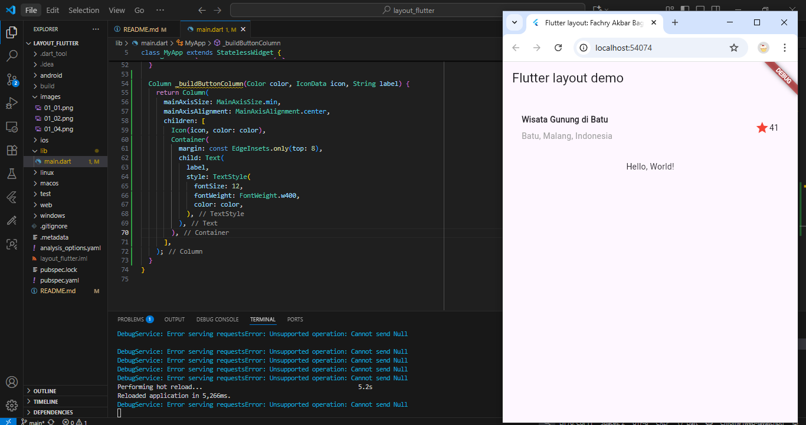
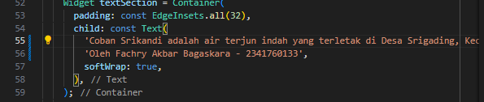
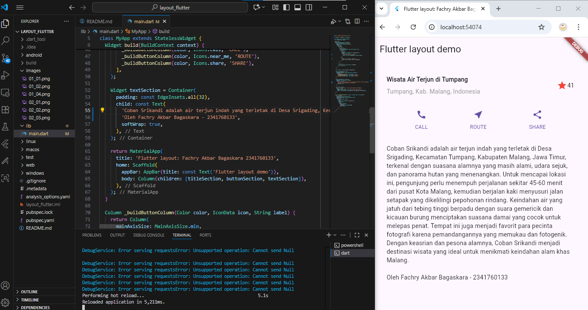

# LAPORAN PRAKTIKUM

## Praktikum 1: Membangun Layout di Flutter   
### Langkah 1: Buat Project Baru

### Langkah 2: Buka file lib/main.dart. Isi nama dan NIM Anda di text title.

### Langkah 3: Identifikasi layout diagram
#### Identifikasi baris dan kolom.
##### Layout utama terdiri dari satu Column besar sebagai struktur utama halaman. Di dalamnya terdapat beberapa bagian: Gambar utama di atas (satu widget sendiri). Baris judul (title row) → menggunakan Row berisi: Sebuah Column (berisi dua Text) di sisi kiri. Sebuah ikon bintang di tengah. Sebuah teks angka (41) di sisi kanan. Baris tombol (button row) → menggunakan Row berisi 3 Column, masing-masing untuk ikon dan teks di bawahnya. Teks deskripsi panjang di bagian bawah → Container berisi Text.
#### Apakah tata letaknya menyertakan kisi-kisi (grid)?
##### Tidak. Layout tidak menggunakan struktur grid seperti GridView. Semua elemen disusun menggunakan kombinasi Column dan Row.
#### Apakah ada elemen yang tumpang tindih?
##### Tidak. Tidak ada elemen yang saling menumpuk, sehingga Stack tidak digunakan. Semua widget disusun secara linear secara vertikal maupun horizontal.
#### Apakah UI memerlukan tab?
##### Tampilan hanya terdiri dari satu halaman sederhana tanpa navigasi tab. Tidak perlu TabBar atau TabView.
#### Perhatikan area yang memerlukan alignment, padding, atau borders.
##### Alignment: Row pada title disusun dengan MainAxisAlignment.spaceBetween atau serupa agar ikon dan angka berada di posisi yang tepat. Column teks judul diratakan ke start (kiri).
##### Padding: Container untuk teks deskripsi diberi padding agar teks tidak menempel pada tepi layar. Container pada judul juga diberi padding bawah agar terpisah dari baris tombol.
##### Borders: Tidak ada penggunaan border secara eksplisit, tetapi padding dan spacing mengatur jarak antar elemen.
### Langkah 4: Implementasi title row

## Praktikum 2: Implementasi button row
### Langkah 1: Buat method Column _buildButtonColumn

### Langkah 2: Buat widget buttonSection

### Langkah 3: Tambah button section ke body

## Praktikum 3: Implementasi text section
### Langkah 1: Buat widget textSection

### Langkah 2: Tambahkan variabel text section ke body

## Praktikum 4: Implementasi image section
### Langkah 1: Siapkan aset gambar

### Langkah 2: Tambahkan gambar ke body

### Langkah 3: Terakhir, ubah menjadi ListView
